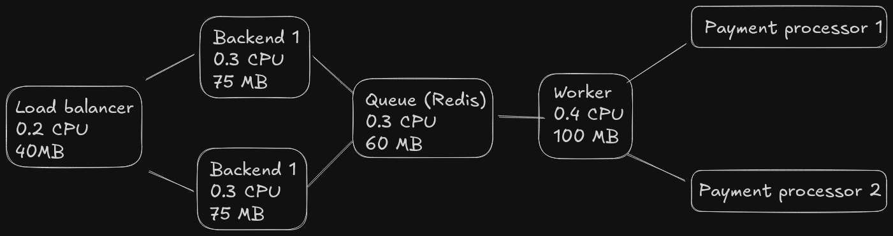

# Rinha de backend 2025

Não ta bom, mas funciona, maior problema que obtive foi o lag nos requests.
Para uma solução feita de forma rápida, em um dia, e ser a primeira competição que participo, acredito que está bom.

## Arquitetura do projeto

### Linguagens usadas:

- Backend: Typescript
- Worker: Typescript