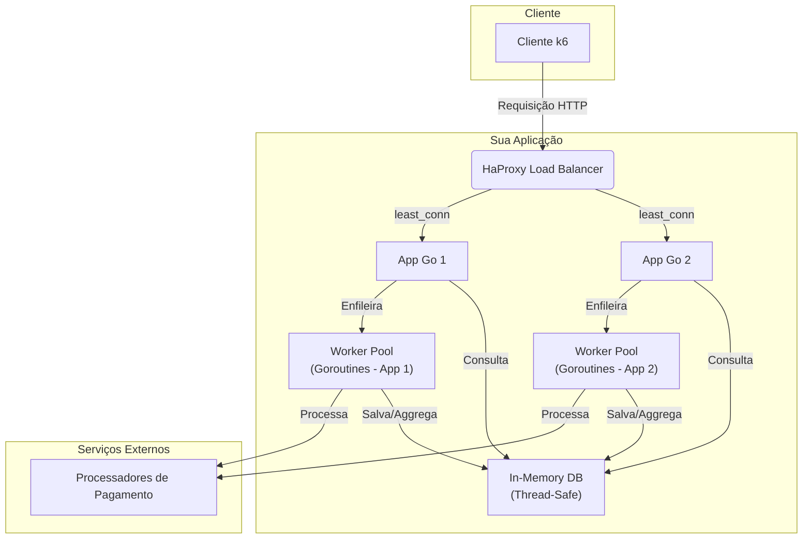

# Submissão Rinha de Backend 2025 - [Rodrigo Militão]

Implementação desenvolvida em Go, focada em **baixa latência**, **processamento assíncrono** e **uso eficiente de memória**.  
Nesta versão, a solução abandona o Redis e utiliza um **banco em memória customizado (in-memory DB)** para armazenar e agregar os pagamentos.

## Link para o Repositório do Código Fonte

[https://github.com/rodrigo-militao/go-rinha-backend-2025/tree/in-memory-db](https://github.com/rodrigo-militao/go-rinha-backend-2025/tree/in-memory-db)

Branch: in-memory-db

## Arquitetura Escolhida

## Fluxo Principal

O HaProxy balanceia as conexões entre as instâncias Go.

As requisições /payments são aceitas imediatamente (202 Accepted) e enfileiradas em memória.

Um worker pool de goroutines consome a fila e processa os pagamentos de forma assíncrona.

Cada pagamento é enviado ao processador externo e, em caso de falha, redirecionado para o fallback.

Os resultados (quantidade e valor total) são persistidos em um banco em memória thread-safe (sync.RWMutex), que suporta queries agregadas rápidas.

As consultas /payments-summary buscam diretamente no in-memory DB, sem hits de rede ou disco.

## Stack de Tecnologias

- Linguagem: Go (fasthttp, pools, worker pattern)
- Banco de Dados: In-Memory DB customizado (slice + RWMutex)
- Fila/Mensageria: Channels (chan []byte + chan *PaymentRequest)
- Load Balancer: HaProxy
- Profiling/Optimização: Go pprof + ajustes de GC, pooling e locks

## Diferenciais da Abordagem In-Memory

- 🔥 Menos hops de rede: sem Redis, toda a comunicação é local em memória.
- ⚡ Baixíssima latência: acesso direto a slices com lock fino (RWMutex).
- 🧠 Uso eficiente de memória: pooling de objetos (sync.Pool) e buffers reutilizáveis para evitar GC pressure.
- 🛡️ Thread-safety garantido: acesso concorrente controlado com RWMutex.
- 🧮 Agregação em tempo real: queries de resumo não percorrem grandes estruturas, retornam apenas os agregados.